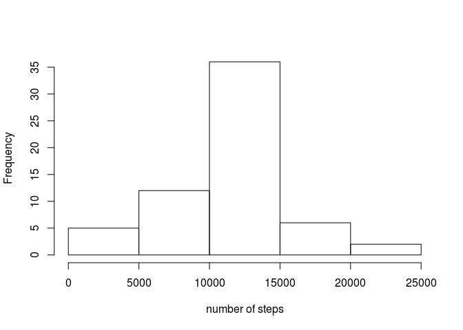

# Reproducible Research: Peer Assessment 1

Set global options and load libraries

```r
knitr::opts_chunk$set(echo = TRUE)
Sys.setlocale("LC_TIME", "C")
library('plyr')
library('ggplot2')
```

## Loading and preprocessing the data

Start by loading the data and transforming the variable 'interval' into a 'POSIXct' object

```r
activity <- read.csv('activity.csv')
temp <- mapply(function(x, y) paste0(rep(x, y), collapse = ""), 0, 4 - nchar(activity$interval))
temp2 <- paste0(temp, activity$interval)
activity$interval <- as.POSIXct(strptime(temp2, format="%H%M"), format = "%H:%M")
```

## What is mean total number of steps taken per day?

Calculate the total number of steps per day and plot the corresponding histogram 

```r
totsteps <- ddply(activity,.(date),summarize, tsteps=sum(steps, na.rm = TRUE))
hist(totsteps$tsteps,main = '', xlab = 'number of steps')
```

<!-- -->

Calculate the mean and the median of the total steps per day

```r
meansteps <- mean(totsteps$tsteps,na.rm = T)
mediansteps <- median(totsteps$tsteps, na.rm = T)
```
The mean and median number of steps per day are **9354.2295082** and **10395**, respectively.

## What is the average daily activity pattern?

Start by creating a new dataset with the mean number of steps for each 5-minute interval across all the days. Then plot the corresponding time series plot and determine the time interval corresponding to the maximum of the mean number of steps.


```r
avsteps <- ddply(activity,.(interval),summarize,msteps=mean(steps, na.rm = T))
plot(avsteps$interval,avsteps$msteps,type = 'l',ylab = 'average number of steps',xlab = 'time of day')
```

<!-- -->

```r
maxinterval <- avsteps$interval[which.max(avsteps$msteps)]
```

The 5-minute interval, averaged across all days, with the maximum number of steps is **08:35**

## Imputing missing values
First, calculate the total number of missing values

```r
totalna <- sum(is.na(activity$steps))
```
The total number of missing values is **2304**.

To replace the missing values, create first a vector with the mean number of steps per 5-minute interval across all days replicated by the number of days in the dataset

```r
  repavsteps <- rep(avsteps$msteps,length(unique(activity$date)))
```

Then, create a vector with the positions of the missing values. Use it to replace the missing values in the original dataset by the mean number of steps of the corresponding 5-minute interval, creating a new data set 'activity2'.


```r
naindex <- is.na(activity$steps)
activity2 <- activity
for (i in 1:length(activity2$steps)) {if (naindex[i] == TRUE) {activity2$steps[i] <- repavsteps[i]}}
```
Create a new dataset to calculate again the total number of steps per day and plot the corresponding histogram. Determine the revised mean and median. 


```r
totsteps2 <- ddply(activity2,.(date),summarize, tsteps=sum(steps, na.rm = TRUE))
hist(totsteps2$tsteps,main = '', xlab = 'number of steps')
```

<!-- -->

```r
meansteps2 <- mean(totsteps2$tsteps)
mediansteps2 <- median(totsteps2$tsteps)
```
The revised mean and median number of steps per day are **10766.19** and **10766.19**, respectively. These values are different from the previously obtained. The impact of replacing the missing data by the mean of the number of steps across all days for the respective 5-minute interval is that the mean and the median both increase and converge with each other.


## Are there differences in activity patterns between weekdays and weekends?

Create a new object 'days' with the weekday for each entry in the dataset. Then use it to create a new variable 'daytype' which indicates if it is a weekday or a weekend day.


```r
activity$date <- as.Date(activity$date)
days <- weekdays(activity$date)
for (i in 1:length(activity$steps)) {if (days[i] == "Saturday" | days[i] == "Sunday") {activity$daytype[i] <- "weekend"} else {activity$daytype[i] <- "weekday"}}
```

Create a new dataset with the mean number of steps for each 5-minute interval, averaged across weekdays or weekend days. Plot the 2 corresponding time series


```r
meansteps <- ddply(activity,.(interval,daytype),summarize, msteps=mean(steps, na.rm = TRUE))
g <- ggplot(meansteps,aes(interval,msteps))+geom_line()+facet_grid(daytype ~ .)+xlab('time of day')+ylab('Average number of steps')+scale_x_datetime(date_labels = "%H:%M")
print(g)
```

<!-- -->
